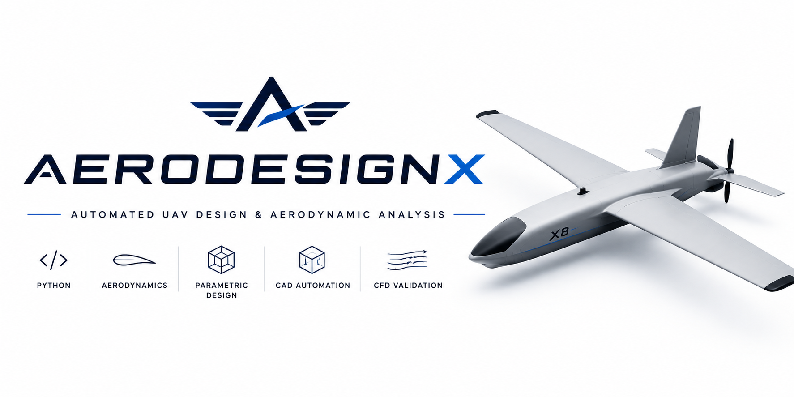
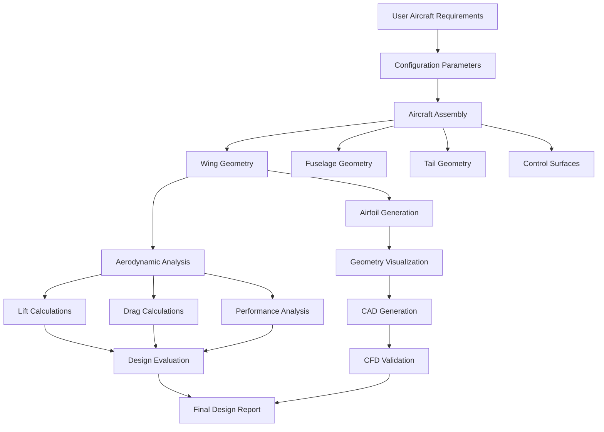
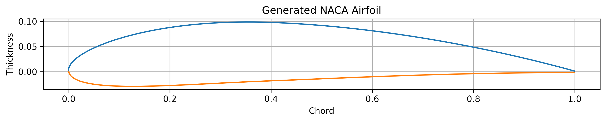
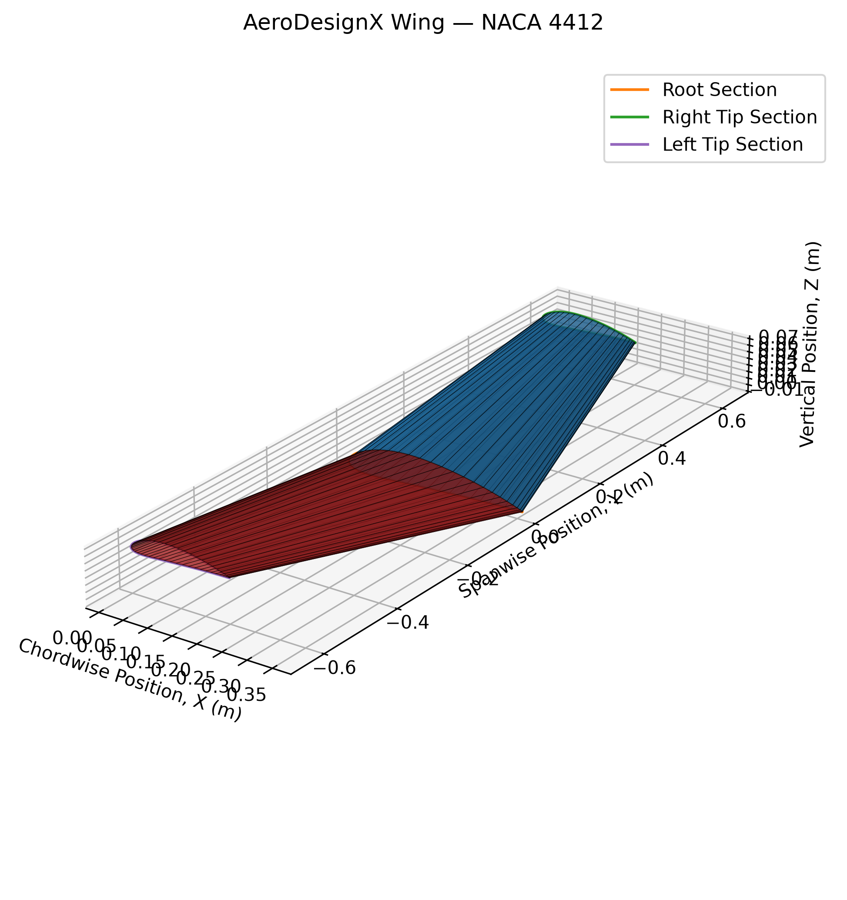
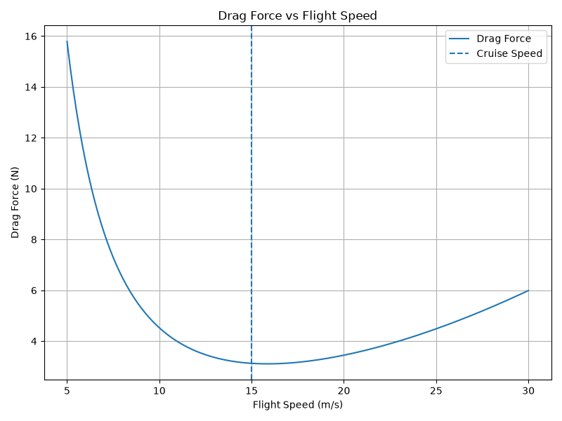
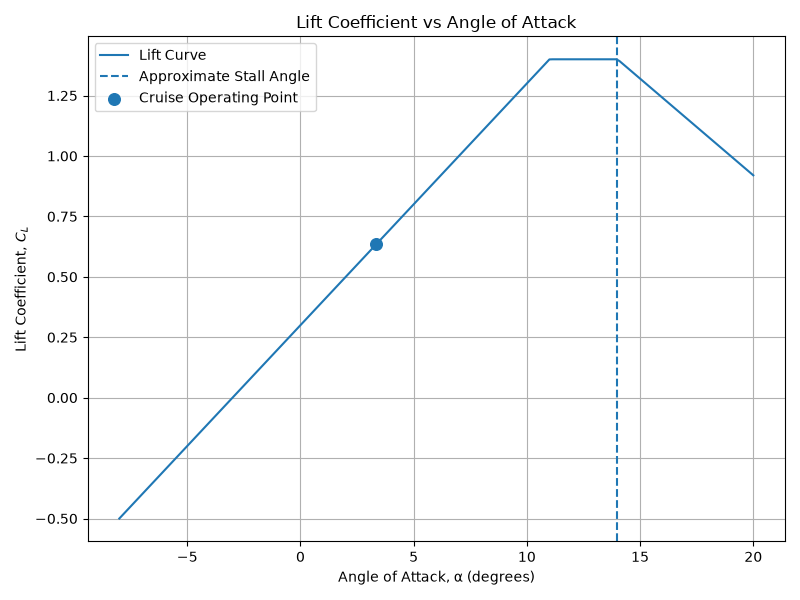
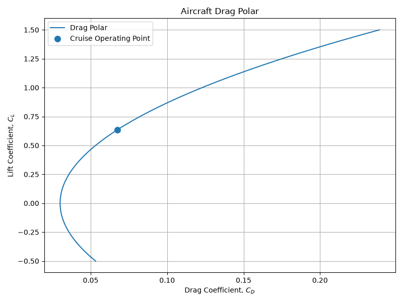
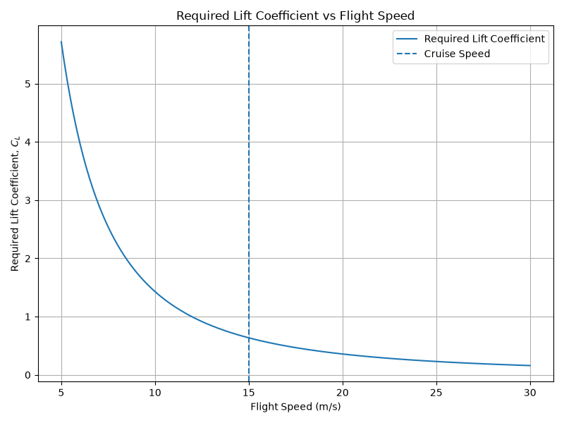

<p align="center">
  
</p>


# AeroDesignX ✈️

### Automated UAV Design and Aerodynamic Analysis in Python


AeroDesignX is a Python-based conceptual aircraft design and analysis tool for small fixed-wing unmanned aerial vehicles.

The project is being developed to connect aircraft requirements, parametric geometry generation, aerodynamic analysis, visualization, CAD generation, and CFD validation into one automated design workflow.

> **Current status:** Active development
> **Primary configuration:** Small fixed-wing UAV
> **Current airfoil support:** NACA four-digit airfoils

---

## Project Overview

Traditional aircraft design often requires engineers to manually transfer information between calculations, geometry models, CAD software, and simulation tools.

AeroDesignX is intended to automate much of that early-stage workflow.

The long-term goal is for a user to define aircraft and mission parameters, such as:

* Aircraft mass
* Cruise speed
* Wing span
* Root and tip chord
* Sweep and dihedral
* Airfoil selection
* Atmospheric conditions

AeroDesignX will then generate and evaluate a preliminary UAV design using aerodynamic calculations, geometry visualization, CAD export, and CFD validation.

---

## Current Capabilities

The current version of AeroDesignX can:

* Represent an aircraft using modular Python classes
* Define rectangular and tapered wing geometry
* Calculate wing area
* Calculate wing aspect ratio
* Calculate taper ratio
* Calculate dynamic pressure
* Calculate the lift required for steady level flight
* Calculate the required lift coefficient
* Generate NACA four-digit airfoil coordinates
* Plot generated airfoil geometry
* Generate and visualize basic wing geometry
* Identify potentially infeasible flight conditions through unusually high required lift coefficients

The project currently uses a baseline UAV configuration for development and testing.

---

## Example Baseline Configuration

| Parameter     | Value       |
| ------------- | ----------- |
| Aircraft mass | 3.0 kg      |
| Cruise speed  | 4.47 m/s    |
| Air density   | 1.225 kg/m³ |
| Wing span     | 1.00 m      |
| Root chord    | 0.30 m      |
| Tip chord     | 0.20 m      |
| Airfoil       | NACA 4412   |

These values are temporary development parameters and will eventually be controlled through a user-facing input system.

---

## Project Architecture



---

## Repository Structure

```text
AeroDesignX/
│
├── main.py
├── README.md
│
├── config/
│   └── parameters.py
│
├── aircraft/
│   └── assembly.py
│
├── geometry/
│   ├── wing.py
│   ├── fuselage.py
│   ├── tail.py
│   └── control_surfaces.py
│
├── aerodynamics/
│   ├── lift.py
│   ├── drag.py
│   ├── reynolds.py
│   ├── performance.py
│   └── analysis.py
│
├── airfoils/
│   └── naca.py
│
├── visualization/
│   ├── plot_airfoil.py
│   └── plot_wing.py
│
├── cad/
│   └── cad_utils.py
│
└── cfd/
    ├── setup.txt
    └── results/
```

Some modules are currently placeholders for functionality planned later in development.

---

## Example Airfoil Generation

AeroDesignX includes a parametric NACA four-digit airfoil generator.

For example, the designation `NACA 4412` represents:

* Maximum camber: 4% of the chord
* Maximum camber location: 40% of the chord
* Maximum thickness: 12% of the chord

The generated upper and lower surface coordinates can be plotted for geometry verification and later used for wing and CAD generation.

## Example Results

### Airfoil Geometry



### Wing Geometry



### Drag Force vs Flight Speed



### Lift Coefficient vs Angle of Attack



### Lift Coefficient vs Drag Coefficient



### Lift Coefficient vs Flight Speed




## Aerodynamic Calculations

### Required Lift

For steady, level flight, lift must equal aircraft weight:

[
L = W = mg
]

where:

* (L) is lift
* (W) is aircraft weight
* (m) is aircraft mass
* (g) is gravitational acceleration

### Dynamic Pressure

Dynamic pressure is calculated using:

[
q = \frac{1}{2}\rho V^2
]

where:

* (\rho) is air density
* (V) is flight velocity

### Required Lift Coefficient

The required lift coefficient is:

[
C_L = \frac{L}{qS}
]

where:

* (L) is required lift
* (q) is dynamic pressure
* (S) is wing reference area

This calculation helps determine whether a proposed aircraft geometry and flight condition are aerodynamically realistic.

For example, a very high required lift coefficient may indicate that the aircraft is flying too slowly, has insufficient wing area, or is too heavy for the selected configuration.

---

## Installation

### 1. Clone the repository

```bash
git clone https://github.com/atharvr2-cmyk/AeroDesignX.git
cd AeroDesignX
```

### 2. Create a virtual environment

On Windows:

```bash
python -m venv .venv
.venv\Scripts\activate
```

On macOS or Linux:

```bash
python3 -m venv .venv
source .venv/bin/activate
```

### 3. Install dependencies

```bash
pip install numpy scipy matplotlib
```

### 4. Run the project

```bash
python main.py
```

---

## Technologies

* Python
* NumPy
* SciPy
* Matplotlib
* Git and GitHub
* SolidWorks or FreeCAD for future CAD automation
* ANSYS Student for future CFD validation

---

## Development Roadmap

### Phase 1 — Core Aircraft Model

* [x] Create modular repository structure
* [x] Implement aircraft and wing classes
* [x] Add tapered wing geometry
* [x] Calculate wing area and aspect ratio
* [x] Implement basic lift calculations

### Phase 2 — Airfoil and Geometry Generation

* [x] Generate NACA four-digit airfoil coordinates
* [x] Plot airfoil geometry
* [x] Visualize preliminary wing geometry
* [ ] Improve three-dimensional wing visualization
* [ ] Integrate airfoil sections into the wing model

### Phase 3 — Aerodynamic Performance

* [ ] Reynolds number calculations
* [ ] Lift-curve estimation
* [ ] Drag polar model
* [ ] Stall-speed estimation
* [ ] Range and endurance calculations
* [ ] Aircraft performance summary

### Phase 4 — Automated CAD

* [ ] Generate three-dimensional wing geometry
* [ ] Generate fuselage and tail geometry
* [ ] Export CAD-compatible geometry
* [ ] Investigate SolidWorks API or FreeCAD automation
* [ ] Assemble the complete UAV model

### Phase 5 — CFD Validation

* [ ] Prepare ANSYS Fluent geometry
* [ ] Define boundary conditions
* [ ] Run baseline CFD analysis
* [ ] Compare analytical and CFD predictions
* [ ] Document model limitations and sources of error

### Phase 6 — User Interface and Reporting

* [ ] Create a user-facing interface
* [ ] Add parameter validation
* [ ] Generate plots automatically
* [ ] Export a complete aircraft design report
* [ ] Create example design case studies

---

## Engineering Goals

AeroDesignX is being developed to demonstrate and strengthen skills in:

* Aircraft conceptual design
* Aerodynamics
* Engineering software development
* Parametric geometry
* CAD automation
* CFD
* Numerical analysis
* Technical documentation
* Verification and validation

---

## Limitations

AeroDesignX is currently an educational and portfolio project under active development.

The current aerodynamic models are preliminary and should not be used for real aircraft certification, manufacturing, or flight-safety decisions.

Future versions will include stronger model validation, more realistic aerodynamic assumptions, expanded geometry support, and comparisons with CFD results.

---

## Author

**Atharv Raghav**
Aerospace Engineering Student
University of Illinois Urbana-Champaign

Interests include aerodynamics, autonomous aircraft systems, aircraft structures, and engineering software development.

---

## License

This project is planned to be released under the MIT License.
